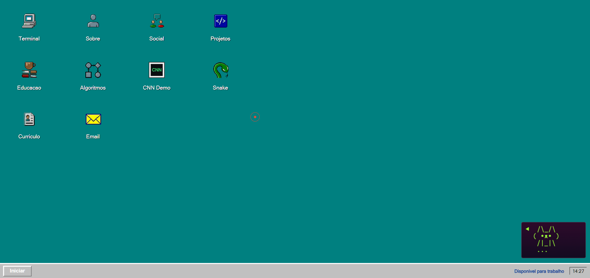
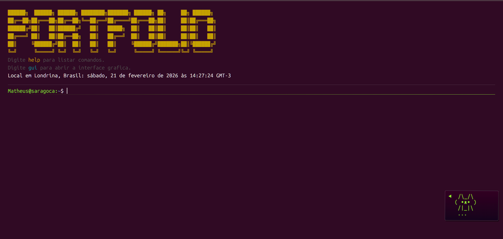

# Portfolio Terminal + GUI

Portfolio SPA com dois modos de interacao:
- terminal estilo CLI;
- GUI retro inspirada no Windows 95.

## Preview

### GUI



### CLI



## Objetivo

Entregar uma experiencia interativa de apresentacao profissional com foco em:
- navegacao por comandos;
- janelas e componentes visuais;
- deploy estatico no GitHub Pages;
- suporte offline parcial com Service Worker.

## Stack

- HTML + CSS + JavaScript (ES Modules).
- Node.js apenas para servidor local e build.
- `esbuild` para minificacao no build de producao.
- GitHub Actions para deploy automatico no GitHub Pages.

## Como rodar localmente

Pre-requisito:
- Node.js 20+ (recomendado).

Comandos:

```bash
npm install
npm run dev
```

Servidor local:
- URL padrao: `http://localhost:8080`
- Porta customizada: definir `PORT` no ambiente.

## Scripts

- `npm run dev`: sobe o servidor local (`scripts/server.js`).
- `npm start`: alias de `dev`.
- `npm run build`: gera `dist/` com arquivos minificados para deploy estatico.
- `npm run lint`: validacoes de JS/TS + checks basicos de HTML.
- `npm run project:map`: imprime no terminal o mapa de pastas e pontos de acesso.
- `npm run worker:dev`: executa o Worker localmente (Cloudflare).
- `npm run worker:deploy`: publica o Worker no Cloudflare.
- `npm run worker:tail`: acompanha logs do Worker.

## Build de producao

```bash
npm run build
```

Saida:
- pasta `dist/` pronta para publicacao;
- JS/CSS minificados;
- arquivos estaticos copiados automaticamente.

Pipeline de build:
- arquivo: `scripts/build.mjs`
- copia arquivos principais;
- percorre `dist/` e minifica `.js` e `.css`.

## Deploy no GitHub Pages

Workflow:
- arquivo: `.github/workflows/pages.yml`
- gatilho: push em `main` e execucao manual.

Fluxo:
- instala dependencias com `npm ci` em `config/`;
- executa `npm run build` em `config/`;
- publica `dist/` via `actions/deploy-pages`.

Arquivos de suporte ao Pages:
- `app/404.html`: fallback de rota para SPA;
- `app/.nojekyll`: desativa processamento Jekyll;
- `app/robots.txt` e `app/sitemap.xml`: indexacao.

## Estrutura principal

- `app/index.html`: bootstrap da aplicacao, meta tags, SEO social, schema JSON-LD.
- `app/main.js`: entrypoint fino que delega para `app/modules/app/bootstrap.js`.
- `app/modules/app/bootstrap.js`: orquestracao de runtime (estado, eventos, i18n, GUI/CLI, SW).
- `app/styles.css`: entrypoint de estilo por camadas.
- `app/styles/`: `base.css`, `components.css`, `themes.css`, `effects.css`.
- `app/data.json`: conteudo textual (pt/en), projetos e metadados.
- `app/modules/core/`: estado base e configuracoes de tema.
- `app/modules/features/`: dominios (`terminal`, `pet`, `gui`, `effects`) com barrels `index.js`.
- `app/modules/index.js`: facade de acesso central para modulos do frontend.
- `app/modules/`: utilitarios auxiliares (`trie`, `levenshtein`, `commandSearch`, `cnnDemo`, `algorithmViewer`, `snakeGame`).
- `app/service-worker.js`: cache e fallback offline.
- `config/wrangler.jsonc`: configuracao do Cloudflare Worker (backend do comando `me`).
- `worker/src/index.ts`: API `/me` com GitHub + Llama 3 (Workers AI).
- `app/manifest.webmanifest`: metadados PWA.
- `scripts/server.js`: servidor HTTP local sem dependencias externas.
- `app/assets/`: imagens, sprites, capas e modelo CNN.

## Comportamento de cache e Service Worker

- Em producao (HTTPS): Service Worker e registrado.
- Em localhost: Service Worker e removido automaticamente para evitar cache sujo durante desenvolvimento.
- Estrategia principal:
  - navegacao/documento e JSON: `networkFirst` com fallback para `index.html`;
  - estaticos: `staleWhileRevalidate`.

## SEO e indexacao

- `canonical`, `og:*`, `twitter:*` e `theme-color` configurados.
- `app/sitemap.xml` e `app/robots.txt` incluidos.
- JSON-LD (`Person`) no `app/index.html`.

## Roteamento SPA no Pages

- `app/404.html` redireciona para `/?p=...`.
- `app/index.html` restaura a rota original no carregamento.
- rotas sem extensao tambem recebem barra final para manter consistencia de caminho.

## Conteudo do portfolio

Fonte unica:
- `app/data.json`

Para atualizar portfolio:
- edite `translations.pt` e `translations.en`;
- atualize links, projetos, educacao e resume no JSON;
- valide com `npm run build`.

## Troubleshooting rapido

- Erro `refresh.js` com `ws://localhost:8081`:
  - nao pertence ao projeto;
  - normalmente vem de extensao de live reload/preview.
- Mudanca nao aparece no browser:
  - faca hard reload (`Ctrl+F5`);
  - limpe SW/caches no DevTools se necessario.
- Deploy nao atualizou:
  - confira run do workflow em `Actions`;
  - confirme que o Pages usa source `GitHub Actions`.

## Documentacao detalhada

- `docs/ARCHITECTURE.md`
- `docs/PROJECT_MAP.md`
- `docs/DEPLOY_GITHUB_PAGES.md`
- `docs/TROUBLESHOOTING.md`
- `docs/CLOUDFLARE_WORKER_ME.md`
