# UML — Portfolio Web (Matheus Saragoca)

Diagramas UML completos do projeto, escritos em [Mermaid](https://mermaid.js.org/).

---

## 1. Diagrama de Casos de Uso

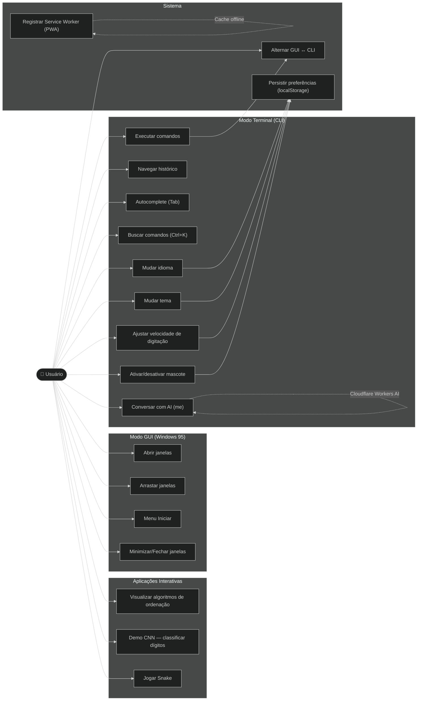

---

## 2. Diagrama de Componentes (Arquitetura)

```mermaid
%%{init: {"theme": "dark"}}%%
graph TB
    subgraph Entry["Ponto de Entrada"]
        HTML["index.html"]
        SW["service-worker.js"]
        MANIFEST["manifest.webmanifest"]
    end

    subgraph Core["Núcleo (main.js)"]
        INIT["Inicialização IIFE"]
        EVT["Event Listeners"]
        CMD["Processador de Comandos"]
        UI["Renderizador de UI"]
    end

    subgraph Modules["Módulos"]
        subgraph CoreMod["core/"]
            STATE["appState.js\n(Estado Central)"]
            THEME["themeConfig.js\n(Temas e Presets)"]
        end
        subgraph Features["features/"]
            TCFG["terminal/config.js"]
            TTYP["terminal/typing.js"]
            GCFG["gui/config.js"]
            PCFG["pet/config.js"]
            PSPR["pet/spriteSheet.js"]
            MTRX["effects/matrixAdaptive.js"]
            FIRE["effects/doomFire.js"]
        end
        subgraph DataStr["estruturas/"]
            SRCH["commandSearch.js"]
            TRIE["trie.js"]
            LEVM["levenshtein.js"]
        end
        subgraph InterApps["apps interativos/"]
            ALGO["algorithmViewer.js"]
            CNN["cnnDemo.js"]
            SNAKE["snakeGame.js"]
        end
    end

    subgraph Assets["Assets"]
        DATAJSON["data.json\n(conteúdo + traduções)"]
        COVERS["assets/covers/*.svg"]
        EDU["assets/edu/*.png"]
        MODEL["assets/web_model/\n(TensorFlow SavedModel)"]
        SPRITE["assets/sprite_94.webp"]
    end

    subgraph External["Externos"]
        CF["Cloudflare Workers\n(/me endpoint + AI)"]
        TF["TensorFlow.js\n(CDN)"]
    end

    HTML --> INIT
    HTML --> SW
    INIT --> STATE
    INIT --> EVT
    EVT --> CMD
    CMD --> UI
    STATE --> THEME
    CMD --> TCFG
    CMD --> TTYP
    CMD --> GCFG
    CMD --> PCFG
    CMD --> PSPR
    CMD --> MTRX
    CMD --> FIRE
    CMD --> SRCH
    SRCH --> TRIE
    SRCH --> LEVM
    CMD --> ALGO
    CMD --> CNN
    CMD --> SNAKE
    INIT --> DATAJSON
    CNN --> MODEL
    CNN --> TF
    CMD -.->|"fetch /me"| CF
    ALGO --> COVERS
    EDU --> UI
    SPRITE --> PCFG
```

---

## 3. Diagrama de Classes (Módulos Principais)

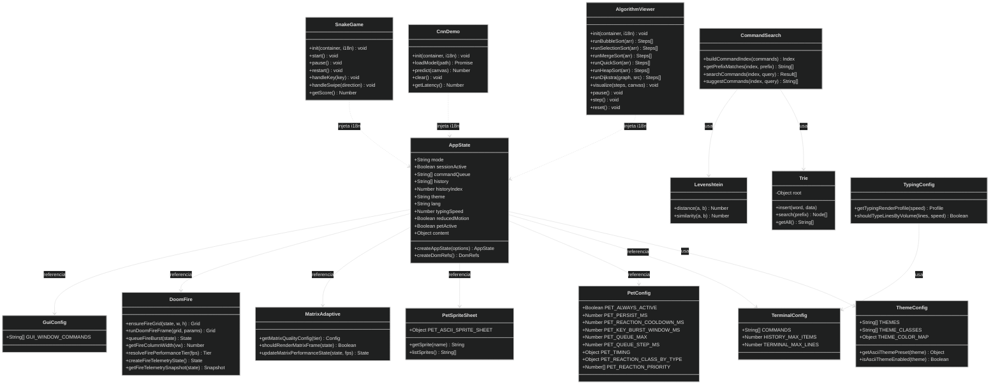

---

## 4. Diagrama de Máquina de Estados (App)

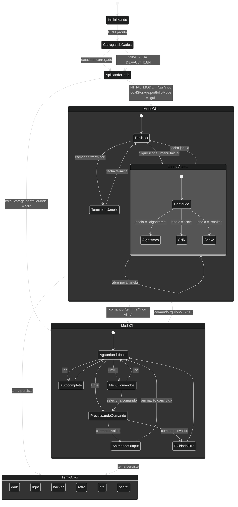

---

## 5. Diagrama de Sequência — Execução de Comando no Terminal

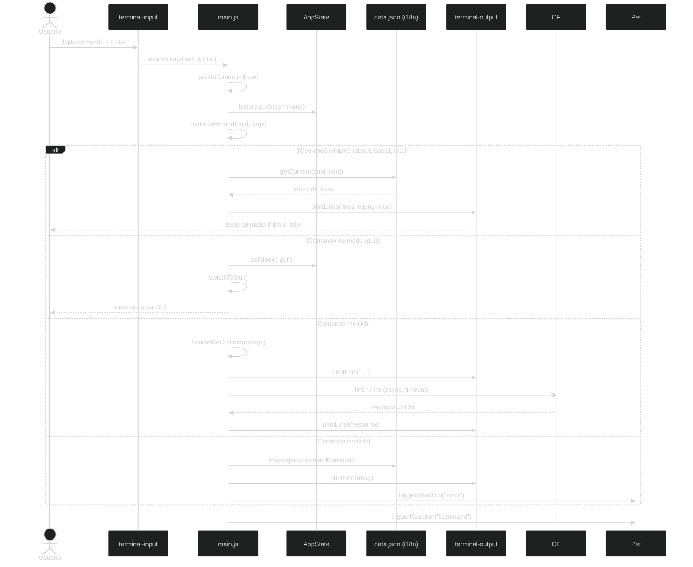

---

## 6. Diagrama de Sequência — Alternância de Modo GUI ↔ CLI

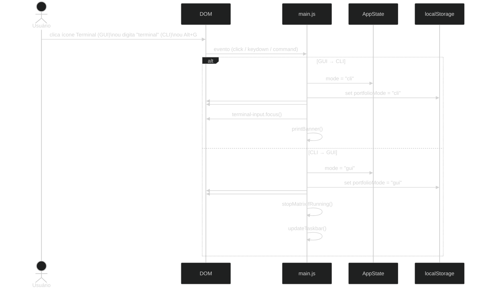

---

## 7. Diagrama de Sequência — Comando `me` (AI Assistant)

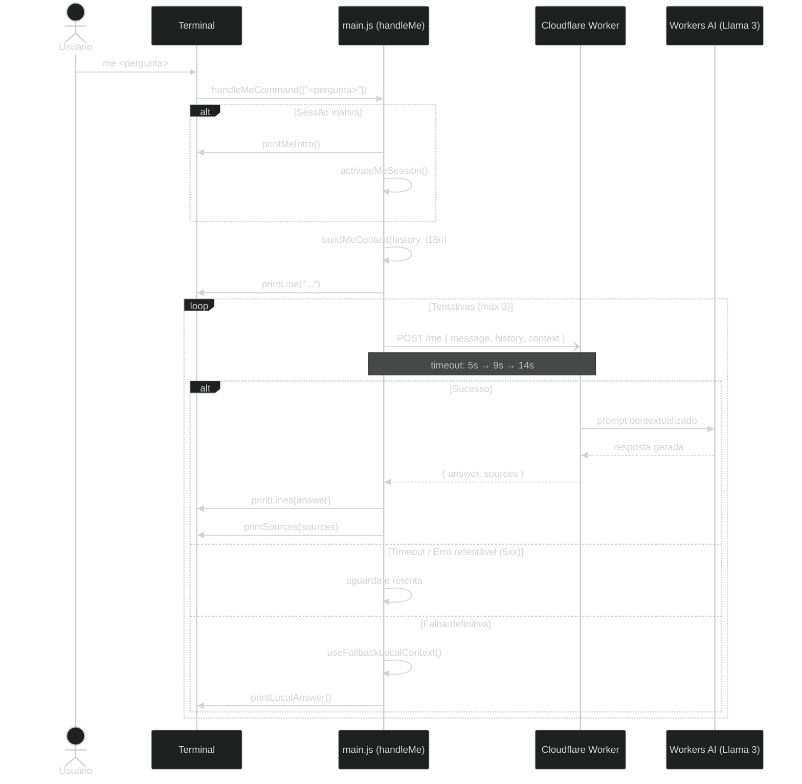

---

## 8. Diagrama de Sequência — Inicialização da Aplicação

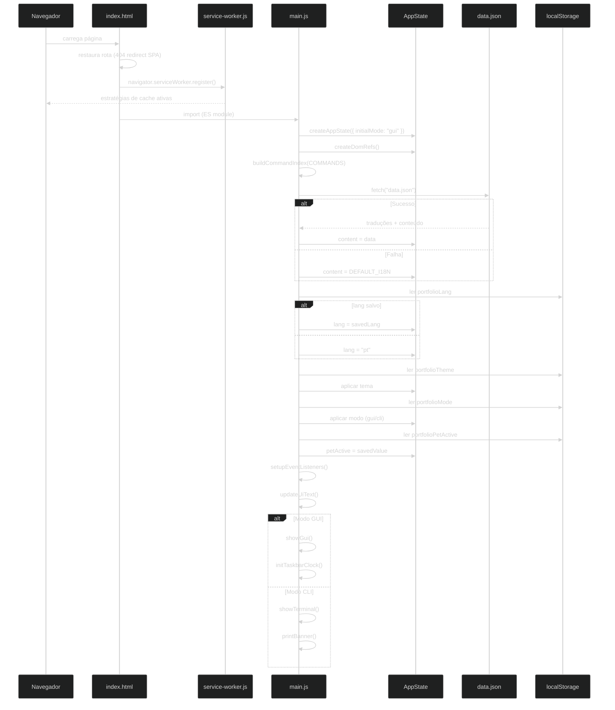

---

## 9. Diagrama de Sequência — Visualizador de Algoritmos

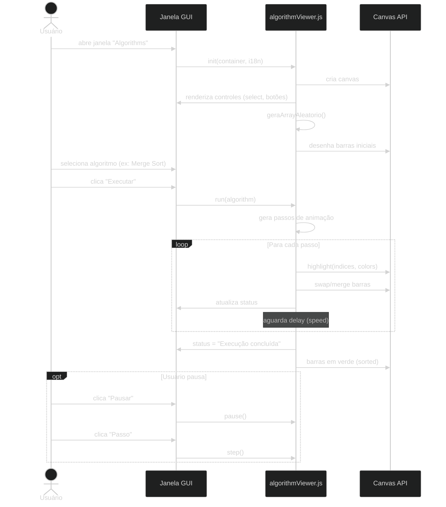

---

## 10. Diagrama de Atividades — Processamento de Tema

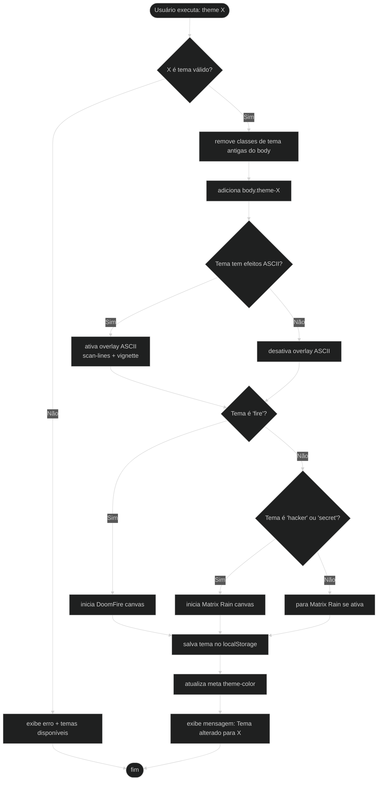

---

## 11. Diagrama de Atividades — Sistema de Mascote (Pet)

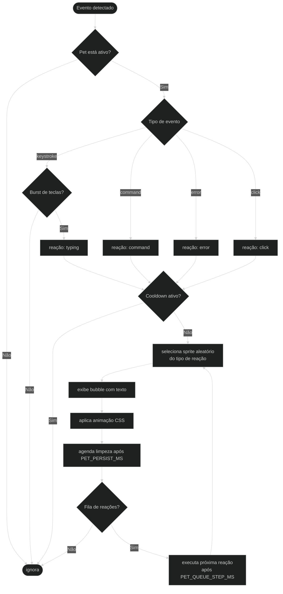

---

## 12. Diagrama de Dados — Fluxo de Conteúdo

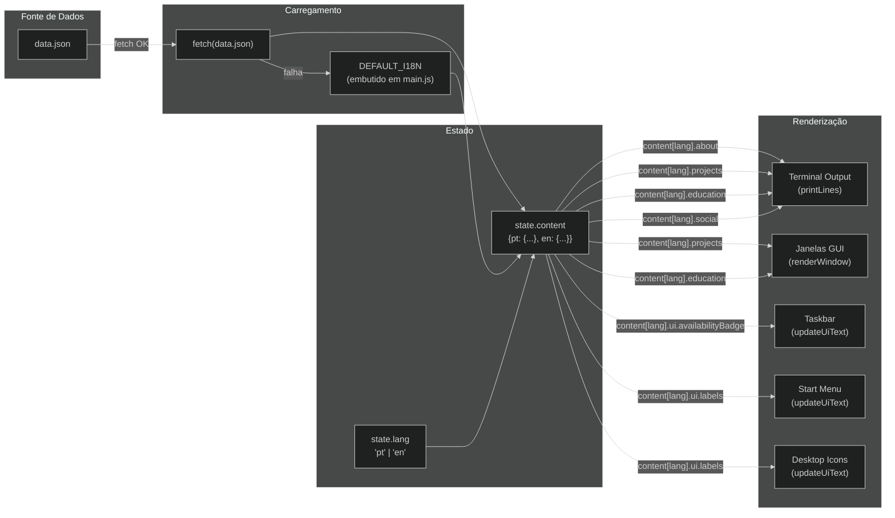

---

## 13. Diagrama de Implantação (Deployment)

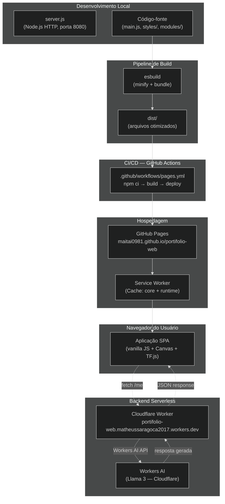

---

## Legenda de Diagramas

| # | Diagrama | Tipo UML |
|---|----------|----------|
| 1 | Casos de Uso | Use Case |
| 2 | Arquitetura de Componentes | Component |
| 3 | Módulos e Relacionamentos | Class |
| 4 | Estados da Aplicação | State Machine |
| 5 | Execução de Comando no Terminal | Sequence |
| 6 | Alternância de Modo GUI ↔ CLI | Sequence |
| 7 | Comando `me` (AI Assistant) | Sequence |
| 8 | Inicialização da Aplicação | Sequence |
| 9 | Visualizador de Algoritmos | Sequence |
| 10 | Processamento de Tema | Activity |
| 11 | Sistema de Mascote | Activity |
| 12 | Fluxo de Dados | Data Flow |
| 13 | Implantação | Deployment |
